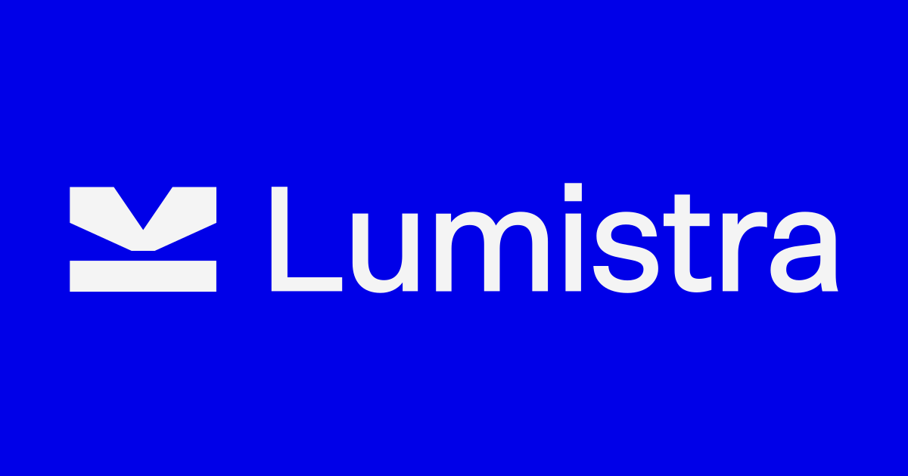

# Official website of Studio Lumistra

### Creative design studio transforming sparks and ideas into brands and experiences.

Check out the live site at [studiolumistra.com](https://studiolumistra.com)

- Designed by: [Studio Lumistra](https://studiolumistra.com)
- Developed by: [Dario Dumlijan](https://github.com/dariodumlijan)

----

## Deployment

This project uses [Github Actions](https://github.com/features/actions) to trigger a deployment and is hosted using [GitHub pages](https://pages.github.com/)

The deployment is triggered by manually running the ["Deploy" workflow](https://github.com/lumistra/lumistra/actions/workflows/deploy.yml)

----

## Development

###### Developed using [Next.js](https://nextjs.org) & [TypeScript](https://www.typescriptlang.org)

### Requirements

| Dependency | Version  |
| ------------------ | -------- |
| [Node.js](https://nodejs.org/en) | `>=20` |
| [yarn](https://yarnpkg.com) | `>=1.22.22` |
| [Storyblok](https://www.storyblok.com) | `N/A` |

### Commands

To install & setup dependencies:
```sh
yarn (install)
```

Run the DEV server for local development in the browser:
```sh
yarn dev
```
The application will be available at [`localhost:3000`](http://localhost:3000)

To build the application for production:
```sh
yarn build
yarn build:sitemap
```

Run tests & linters
```sh
yarn tsc

yarn lint

yarn test
```

Get test coverage report:
```sh
yarn test:coverage
```

### Project .env variables
```sh
STORYBLOK_API_TOKEN="<secret>" # Required
GTM_ID="<secret>"
SITE_URL="https://studiolumistra.com"
BASE_PATH="lumistra" # Not required with a custom domain
MOCK_API="true" # To minimise API calls in development
```
